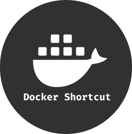
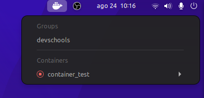
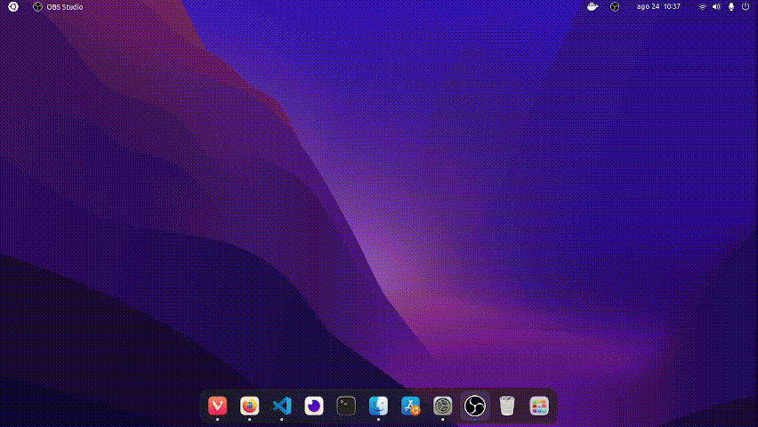

<h2 style="font-size: 1.5em;" align="center">

  

  Gnome shell extension to manage Docker containers

</h2>

# Table of contents

<!--ts-->

- [Docker Shortcut Screenshot](#docker-shortcut-screenshot)
- [Features](#features)
- [Features Examples](#features-examples)
  - [Open shell with custom startup command](#open-shell-with-custom-startup-command)
  - [Group containers](#group-containers)
- [Author](#author)

<!--te-->

# Docker Shortcut Screenshot

# Features

<!--ts-->
- Start/Stop containers
- Pause/Unpause containers
- Restart containers
- Remove containers
- View containers logs
- Open containers shell
  - [Set a command to be executed when opening the container shell](#open-shell-with-custom-startup-command)
- [Group containers](#group-containers) by **_prefix__**
<!--te-->

# Features examples

## Open shell with custom startup command

## Group containers

# Author

Made with 💜 by <a href="https://github.com/DanielGustavo"><b>Daniel Gustavo</b></a>

